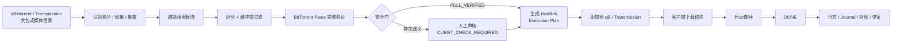
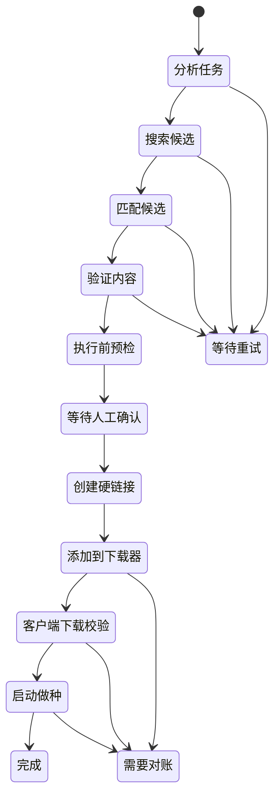

<div align="center">

# 🚀 PackBreaker

### PT 大包自动拆包 · 内容级验证 · Hardlink 辅种 · AI 运维

**让几十 TB 的 PT 大包辅种，从重复劳动变成一条安全、可验证、可恢复的自动化流水线。**

<p>
  <a href="https://www.python.org/"></a>
  <a href="https://vuejs.org/"></a>
  <a href="https://www.docker.com/"></a>
  
  <a href="./LICENSE"></a>
</p>

<p>
  <a href="#features">✨ 功能</a> ·
  <a href="#workflow">🧬 工作流</a> ·
  <a href="#ai-agent">🤖 AI</a> ·
  <a href="#security">🔐 安全</a> ·
  <a href="#quick-start">📦 快速开始</a> ·
  <a href="./docs/README.md">📚 文档</a>
</p>

</div>

PackBreaker 是一个面向 PT 场景的**自动拆包辅种系统**。它从 qBittorrent / Transmission 的大包任务或媒体目录出发，自动完成**内容识别 → 跨站搜索 → Piece 级验证 → 人工审核 → Hardlink 复用 → 客户端校验 → 启动做种 → 故障恢复**。

如果你曾经为了一个大包手工拆目录、挨个搜站、比文件、算大小、建硬链接、加种、重检、盯 99%、修失败任务——**PackBreaker 的目标，就是把这整套苦力活压缩成一条真正可控的自动化工作流。**

> **不是“能跑就行”的辅种脚本。**
>
> PackBreaker 更在意：候选到底是不是同一份内容、Hardlink 会不会伤到源数据、动作执行到一半崩溃后能不能恢复、升级失败后能不能回滚。

<table>
  <tr>
    <td align="center"><strong>🎬 自动拆包</strong><br>影片 / 剧集 / 季 / 集 / Specials</td>
    <td align="center"><strong>🧬 字节级验证</strong><br>BitTorrent v1 / v2 / hybrid</td>
    <td align="center"><strong>🛡️ 安全执行</strong><br>Gate / Plan / Journal / Recovery</td>
    <td align="center"><strong>🤖 AI 运维</strong><br>只读 Tool + Telegram 对话</td>
  </tr>
</table>

| **722** 后端测试 | **76** 前端测试 | **28/28** qB 真实路径映射 | **3220/3220** Transmission 真实路径映射 |
| ---: | ---: | ---: | ---: |
| 全量通过 | 全量通过 | 全部成功 | 全部成功 |

---

<a id="workflow"></a>

## 🚀 30 秒看懂 PackBreaker



PackBreaker 不是“文件名看起来像就直接加种”的脚本。它把**候选发现、内容验证、人工确认、文件复用、客户端下载器动作、故障恢复**拆成清晰的状态链，每一个真正会产生副作用的动作都有对应安全门。

---

<a id="features"></a>

## ✨ 功能全景

| 模块 | 能力 |
| --- | --- |
| 🎬 **自动拆包与识别** | 从大包或目录中识别影片、电视剧、季/集、Specials 与多版本内容，支持手动任务和监控任务 |
| 🔎 **跨站候选搜索** | 统一站点适配器、逐步放宽查询、候选评分、硬冲突过滤、IMDb 等元数据辅助匹配 |
| 🧬 **内容级验证** | 支持 BitTorrent **v1 / v2 / hybrid**，包含跨文件 piece、Merkle、padding、零长度文件等复杂场景 |
| 🔗 **零拷贝数据复用** | 通过 Hardlink 复用已有媒体数据；写入修复前强制 inode 隔离，保护源文件 |
| 🧠 **安全执行引擎** | Preflight、人工审核、Execution Gate、Execution Plan、operation journal、幂等执行、崩溃恢复 |
| 🧲 **qB / Transmission** | 多实例管理、测试连接、实时上传/下载速度、任务总大小、剩余空间、任务数量、路径映射诊断 |
| 🛠️ **99% / 异常修复** | 支持客户端下载校验、失败重试、repair、缺失附属文件处理、对账与人工修复入口 |
| 🗂️ **任务中心** | 手动拆包、监控拆包、Cron、执行记录、成功/失败计数、重试、状态追踪 |
| 🌐 **站点管理** | 固定可信站点 Profile、Cookie/API Key、UA、浏览器请求头仿真、独立代理、连接测试、用户详情 |
| 🔔 **通知系统** | Telegram / Server酱、事件订阅、独立代理、测试消息、失败重试、站内 Inbox |
| 🤖 **AI 助手** | OpenAI / OpenAI-compatible、自定义 Base URL / Model、只读 Tool、Telegram Long Polling 对话 |
| 🧾 **日志与诊断** | 结构化日志、筛选查询、脱敏导出、系统健康、诊断包、trace_id |
| 💾 **备份与恢复** | SQLite 一致性备份、计划备份、校验、离线恢复、升级前自动快照 |
| ⬆️ **安全升级** | Release digest 校验、Preflight、一次性 updater helper、健康检查、失败自动回滚 |
| 👤 **管理体验** | 用户名密码登录、首次临时密码、强制改密、头像抽屉、深浅主题、站内通知、About |

---

## 🧨 为什么它和普通“辅种脚本”不太一样

### 1. 它真的会验证内容，而不是只相信文件名

候选 torrent 不会因为名称、大小或 IMDb ID 看起来像就被直接执行。PackBreaker 会尽可能把“看起来对”推进成“**内容确实对**”。

- BitTorrent v1 piece 验证
- BitTorrent v2 Merkle / piece layer 验证
- hybrid 双协议一致性检查
- 多文件跨边界 piece
- padding / 零长度文件
- 文件快照与当前性检查

对于不能被严格证明的内容，PackBreaker 宁愿停下来让你确认，也不会赌一次“应该没问题”。

### 2. 它把 Hardlink 当成高风险写操作认真处理

Hardlink 很高效，也很危险：对链接目标的写入可能直接影响源文件。

PackBreaker 的执行链会持续证明路径、inode、device、ownership 和 journal 状态。需要写入修复时，会先把目标隔离成独立 inode，再允许客户端下载器修改。

**目标很简单：辅种可以失败，源数据不能坏。**

### 3. 它能从“动作已经发生，但程序没来得及记账”这种最麻烦的故障里恢复

PackBreaker 使用 operation journal 记录副作用意图和结果。即使遇到：

- 请求已经发给下载器但响应丢失
- Hardlink 已创建但数据库还没提交
- verify/start 成功后进程崩溃
- 容器重启
- 升级失败

系统也会优先根据真实状态和历史证据进行**只读对账**，而不是盲目重做同一个动作。

---

## 🧩 核心工作流



真正的下载器写操作不会从“搜索结果”直接跳过去。中间存在验证、审核、Gate、Plan 和 Journal，多层安全边界共同决定一个候选是否有资格执行。

---

## 🧲 下载器支持

当前真实验证基线：

| 下载器 | 已验证版本 | 当前能力 |
| --- | --- | --- |
| **qBittorrent** | 5.2.3 / WebAPI 2.15.1 | 认证、Torrent 读取、路径映射、运行指标、添加、recheck、start、remove、恢复 |
| **Transmission** | 4.1.3 / RPC 6.0.1 | JSON-RPC、Torrent 读取、路径映射、运行指标、add、verify、start、remove、恢复 |

v0.1.6 真实环境验收中，qBittorrent 28/28、Transmission 3220/3220 个真实 Torrent save path 均成功映射到容器目录。

---

## 🌐 站点支持

正式可配置：

- **M-TEAM** — API Key
- **HDTime** — Cookie
- **HHClub** — Cookie

站点地址由后端受信任 Profile Registry 固定，避免把 Cookie / API Key 发送到用户误填的第三方域名。

已经进入 Registry、但仍处于 **PENDING_ADAPTER** 的计划站点：

- KeepFrds
- HDHome
- UBits
- HDFans
- BTSCHOOL
- PTTime
- Rousi Pro

这些站点会在界面中标明“待适配”，在适配器、共享契约测试与真实只读验收完成前，前端和后端都会阻止保存或探测。

---

<a id="ai-agent"></a>

## 🤖 AI 助手：让 PackBreaker 能“看懂自己的系统状态”

v0.1.6 加入了第一版只读 AI Agent。

支持：

- OpenAI 官方 API
- OpenAI-compatible 第三方服务
- 自定义 Base URL
- Model 自由填写，不依赖后端模型白名单
- API Key 加密进入 SecretStore
- 真实 Provider Probe
- Telegram Long Polling 对话
- Chat ID / User ID allowlist
- 有界会话上下文
- 每会话限流

AI 只能通过白名单只读 Tool 获取 PackBreaker 信息，例如：

- 系统健康
- 版本状态
- 任务列表与执行详情
- 脱敏日志
- 站点状态
- 下载器状态
- 帮助文档

> **AI 不拥有 Shell、任意 SQL、任意 URL 或执行任务的能力。**
>
> v0.1.6 不提供 Web AI Chat，AI 对话入口固定在 Telegram。它可以帮你“看系统、查问题、解释状态”，但不能绕过 PackBreaker 原有的人工确认、CSRF、Idempotency-Key、Execution Gate 或 operation journal。

---

<a id="security"></a>

## 🔐 安全不是附加功能，是主流程的一部分

PackBreaker 对“自动化”采用偏保守的设计：

- 源数据默认只读
- 不明确的候选不自动批准
- 不允许任意站点 URL 接收凭证
- Secret 只以密文进入数据库
- Cookie / API Key / Token / 密码不会通过 GET API 回显
- 日志、通知、诊断包和 AI Tool 上下文统一脱敏
- 路径穿越、绝对路径、NUL、符号链接逃逸失败关闭
- 下载器写操作必须经过幂等和 journal
- 回滚只处理能证明属于 PackBreaker 的资源
- 真实环境测试默认只读，普通 CI 永不连接真实 PT / 下载器

**自动化的价值不应该建立在“出了问题再说”之上。**

---

## 🖥️ 管理界面

v0.1.6 管理端覆盖：

- 总览 Dashboard
- 任务中心
- 预演与确认
- 站点管理
- 下载器管理
- 清理与对账
- 日志中心
- 系统设置
  - 通知渠道
  - AI 助手
  - 备份策略
- 用户抽屉
  - Inbox
  - 深浅主题
  - 修改密码
  - 退出登录
- About / 版本更新

桌面和移动端共享同一套功能模型，关键操作均保留明确状态和失败原因。

---

<a id="quick-start"></a>

## 📦 快速部署

### Docker Compose

如果直接部署正式 v0.1.6，可以创建一个 `compose.yaml`：

```yaml
services:
  packbreaker:
    image: ghcr.io/yyxiaoma/packbreaker@sha256:b250b4dd945648fca884989d4c6ce14692dea839d4364f462d6080806357f13d
    container_name: packbreaker
    restart: unless-stopped
    user: "0:0"
    ports:
      - "8000:8000"
    environment:
      PUID: "0"
      PGID: "0"
      PACKBREAKER_TIMEZONE: "Asia/Shanghai"
    volumes:
      - /root/packbreaker/config:/config
      - /path/to/common/storage:/data
      # 可选：需要在 Web 中一键升级时挂载。
      - /var/run/docker.sock:/var/run/docker.sock
    healthcheck:
      test: ["CMD", "python", "-m", "backend.app.healthcheck"]
      interval: 30s
      timeout: 5s
      retries: 3
      start_period: 20s
    security_opt:
      - no-new-privileges:true
```

把 `/path/to/common/storage` 替换为 qBittorrent / Transmission 与 PackBreaker 都能访问的公共媒体父目录。源文件与 Hardlink 目标应尽量位于同一文件系统，否则创建 Hardlink 时会因 `EXDEV` 失败。

启动：

```bash
docker compose up -d
```

默认访问：

```text
http://<服务器IP>:8000
```

> **Compose 用户可以自行选择升级方式。**
>
> - **宿主机升级**：不挂载 `docker.sock`，在宿主机修改 `image:` 的正式 Release digest，再执行：
>
> ```bash
> docker compose pull
> docker compose up -d
> ```
>
> - **Web 一键升级**：挂载 `/var/run/docker.sock:/var/run/docker.sock`，PackBreaker 会通过一次性 updater helper 重建当前容器，并保留 Compose labels、端口、环境变量、挂载、restart policy 和受支持的单网络配置。
>
> Web 升级不会修改宿主机上的 `compose.yaml`。升级成功后，请把 YAML 中的 `image:` 同步到新 Release digest；否则以后再次执行 `docker compose up -d` 时，Compose 可能按旧声明重新创建旧版本。
>
> `docker.sock` 等价于 Docker 主机级管理权限，只应在受信宿主机上启用。
>
> **版本说明：正式 v0.1.6 镜像仍包含旧的 Compose Web 升级阻断；上述 Compose Web 升级能力从当前 main / 下一正式版本开始提供。**

### 独立 Docker 容器

```bash
docker run -d \
  --name packbreaker \
  --restart unless-stopped \
  --user 0:0 \
  -e PUID=0 \
  -e PGID=0 \
  -e PACKBREAKER_TIMEZONE="Asia/Shanghai" \
  -p 8000:8000 \
  -v /root/packbreaker/config:/config \
  -v /path/to/common/storage:/data \
  -v /var/run/docker.sock:/var/run/docker.sock \
  ghcr.io/yyxiaoma/packbreaker:latest
```

挂载 `docker.sock` 后可以使用单容器一键升级；它等价于 Docker 主机级管理权限，只应在受信任宿主机上启用。不希望授予该权限时，请参考 [部署文档](./docs/deployment.md) 使用手工 digest 升级或独立 updater helper。

### 第一次登录

默认管理员用户名：

```text
admin
```

如果没有配置管理员密码，PackBreaker 首次启动会生成一个**一次性临时密码**，只输出到容器启动日志，不进入普通结构化日志、数据库、通知或 AI 上下文。

查看：

```bash
docker logs packbreaker
```

使用临时密码登录后必须立即修改密码。

---

## 🛠️ 本地开发

环境：

- Python 3.11
- Node.js 22.12+
- pnpm 10.34.5
- uv

安装并启动前端：

```bash
corepack pnpm --dir frontend install --frozen-lockfile
corepack pnpm --dir frontend dev
```

常用质量门：

```bash
uv run python scripts/check.py
uv run python scripts/test.py
```

其中：

- `scripts/check.py`：仓库安全扫描、Ruff、mypy、Prettier、Vue typecheck、OpenAPI 漂移检查
- `scripts/test.py`：后端 pytest、前端 Vitest、production build

---

## 📊 当前状态

**v0.1.6 已正式发布。** 当前 `main` 保持 v0.1.6 版本线并包含发布后的文档/基线更新；正式部署身份以 [GitHub Releases](https://github.com/YYxiaoma/PackBreaker/releases) 中的 release manifest 与不可变 image digest 为准。

v0.1.6 当前自动化、现场与正式发布证据包括：

- 后端 722 tests passed
- 前端 15 个测试文件 / 76 tests passed
- production build 通过
- browser warm E2E 通过
- qBittorrent / Transmission 真实只读连接与路径映射通过
- M-TEAM / HHClub 真实用户详情读取通过
- v0.1.5 数据库副本升级到 v0.1.6 migration head 通过
- AI Secret canary 证明原始敏感值不会进入 Provider Tool 上下文
- Release workflow run `35297829243` 已完成真实 Docker 升级/回滚、updater helper E2E、SBOM、release manifest 与 GitHub Release 发布
- 正式不可变镜像：`ghcr.io/yyxiaoma/packbreaker@sha256:b250b4dd945648fca884989d4c6ce14692dea839d4364f462d6080806357f13d`

完整支持边界和已知限制请看：

- [支持矩阵](./docs/support-matrix.md)
- [已知限制](./docs/known-limitations.md)
- [v0.1.6 真实环境验收](./docs/v0.1.6-real-environment-acceptance.md)
- [部署与运维](./docs/deployment.md)
- [研发文档索引](./docs/README.md)

---

## 🧱 技术栈

**Backend**

Python 3.11 · FastAPI · SQLAlchemy · Alembic · SQLite WAL · asyncio · APScheduler

**Frontend**

Vue 3 · Vite · TypeScript strict · Element Plus · Pinia · Axios · ECharts

**Quality & Release**

pytest · Ruff · mypy · Vitest · Playwright · OpenAPI generated types · Docker · GitHub Actions · SBOM · immutable image digest

---

## 🤝 贡献与开发约束

如果你准备修改核心匹配、文件系统、下载器写链、迁移、安全或 AI Tool，请先阅读 [AGENTS.md](./AGENTS.md) 和 [研发文档索引](./docs/README.md)。

PackBreaker 更欢迎“证据更强、恢复更稳、安全门更清晰”的改动，而不是单纯让流程跑得更激进。

---

## 📄 License

PackBreaker 使用 [MIT License](./LICENSE)。
