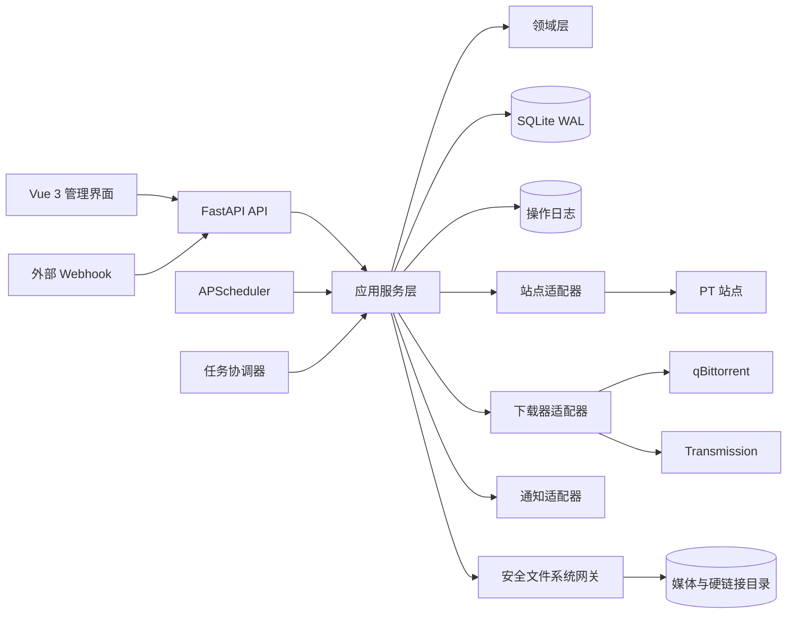
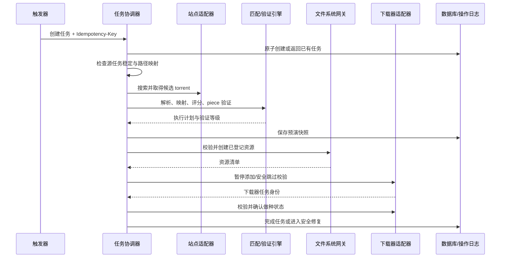

# 系统架构设计

## 1. 目标与边界

PackBreaker v1.0 采用单容器、单应用进程架构，面向单机自用和 NAS 部署。FastAPI 同时提供 API、Webhook、健康检查和前端静态资源；后台调度与任务 worker 在同一进程内运行；SQLite WAL 持久化配置、任务、操作日志和恢复检查点。

首版不支持多租户、分布式 worker、远程对象存储和多副本并发运行。进程启动时必须取得实例锁；无法取得锁时拒绝启动任务执行器，避免两个实例同时修改同一数据目录。

## 2. 逻辑架构

## 3. 分层职责

### 3.1 展示与接口层

- FastAPI 路由负责认证、输入校验、响应序列化、幂等键接收和 trace_id 注入。
- Vue 负责状态展示、预演确认、配置和运维操作，不在浏览器中实现匹配与安全判断。
- 路由不得直接调用站点 SDK、下载器 SDK、SQLAlchemy Session 或原始文件 API。

### 3.2 应用服务层

- 编排解析、搜索、匹配、验证、预演、链接、添加、校验、修复和回滚用例。
- 管理事务边界、状态转换、任务锁、重试计划和操作日志。
- 将领域结果转换为适配器请求，但不解析站点私有响应。

### 3.3 领域层

- 保存任务状态机、候选评分、验证等级、文件映射、安全门和错误分类。
- 领域对象不依赖 FastAPI、SQLAlchemy、具体下载器 SDK 或 HTTP 客户端。
- 所有允许/拒绝执行的结论必须能返回机器可读原因和用户可读证据。

### 3.4 基础设施层

- SQLAlchemy repository、Alembic、加密存储、站点/下载器/通知适配器。
- Torrent 元数据解析、piece 验证、路径解析、安全文件系统网关。
- 外部调用统一接入超时、有限重试、速率限制、熔断、脱敏日志和指标。

## 4. 核心运行流

## 5. 并发与资源控制

- API 请求、轻量数据库操作和外部 HTTP 使用 asyncio。
- 文件扫描与 hash 计算通过受限线程池执行，禁止占用事件循环；默认全局仅允许 1 个重磁盘验证任务，后续按实测开放配置。
- 每个站点使用独立并发信号量和 token bucket；下载器写操作按实例串行化。
- 同一源任务和同一目标候选使用数据库任务锁，锁包含 owner、获取时间和过期时间。
- 调度器只创建任务或唤醒到期任务，不直接执行长流程。
- SQLite 写事务保持短小；外部网络、hash 和文件操作不得包在数据库事务中。

## 6. 一致性与恢复模型

系统无法对数据库、文件系统和下载器执行单一 ACID 事务，因此采用“操作日志 + 幂等动作 + 对账”的最终一致性模型：

1. 在数据库记录待执行动作及预期目标。
2. 使用稳定幂等键调用文件系统或下载器。
3. 保存外部资源身份、设备/inode 快照和结果。
4. 崩溃恢复时先查询真实状态，再决定补记、继续、回滚或转人工。

系统不得假定“数据库状态等于外部真实状态”。当前启动恢复已覆盖 `LINKING`、`ADDING`、`CLIENT_VERIFYING`、`SEEDING` 与 `ROLLING_BACK`：按最久未更新优先有界扫描，每个任务只通过既有 stage coordinator 查询/兑现 journal 与真实文件系统/qB 状态；同一 stage 一次 tick 后仍未变化即停止本轮，不在应用启动期间长轮询。取消/回滚同样只依据冻结 checkpoint 与 operation journal 所有权恢复：qB 任务移除固定保留数据，文件系统只逆序撤销 PackBreaker 明确登记且快照仍匹配的 hardlink/空目录。可归类的单任务安全错误只记录稳定错误码并继续扫描，程序级异常仍使启动失败但必须释放进程锁。

## 7. 可观测性

- 每次 API 请求、任务、任务单元和外部调用都关联 trace_id。
- 记录结构化日志字段：事件、阶段、任务、适配器、耗时、结果、错误码；先脱敏再输出。
- 指标至少覆盖任务数量/耗时/成功率、候选命中、验证吞吐、站点限流、下载器错误、重试和待人工数量。
- 健康检查分为存活与就绪；外部 PT 站故障显示为依赖降级，不触发容器重启循环。

## 8. 关键架构决策

| 决策 | 结论 | 原因 |
| --- | --- | --- |
| 部署单元 | 单镜像、单应用进程 | 符合单机自用，减少消息队列和分布式一致性成本 |
| 数据库 | SQLite WAL + Alembic | 满足规模，支持可靠迁移与短事务并发 |
| 后台任务 | asyncio 队列 + 持久化状态机 | 外部 I/O 为主，且需崩溃恢复 |
| 副作用 | operation journal | 文件系统与下载器不支持跨系统事务 |
| 核心扩展 | 适配器契约 | 站点与下载器差异不得进入主流程 |
| 数据验证 | 本地 piece 验证为最高安全门 | 名称、大小和媒体 ID 不能证明字节一致 |

分布式 worker、PostgreSQL 或独立任务队列只有在单进程实测无法满足目标规模时才重新评估。
