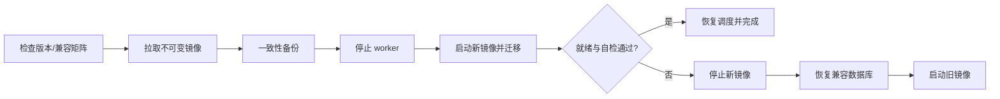

# 部署、运维与安全

## 1. 部署目标

v1.0 以单个 `linux/amd64` Docker 镜像发布，单容器内运行 FastAPI、前端静态资源、调度器和单进程 worker。SQLite、日志、密钥与备份保存在 `/config`，媒体和硬链接目标通过 `/data` 暴露。

首版不支持 Kubernetes、多副本或共享数据库。容器必须使用 init/锁机制确保同一 `/config` 只有一个活动 worker。

## 2. 镜像结构

采用多阶段构建：

1. Node 22 构建 Vue 前端。
2. Python 3.11 构建锁定依赖和应用环境。
3. 精简 Python 3.11 runtime 复制后端、迁移和前端 dist。

运行镜像要求：

- 使用非 root 用户；通过 `PUID`/`PGID` 或部署时指定 user 匹配 NAS 文件所有权。
- 只包含运行依赖，不包含测试工具、源码缓存、Node modules 和真实配置。
- 固定基础镜像 digest并生成 SBOM；发布标签不可覆盖，另提供可移动 channel 标签。
- OCI 标签包含版本、Git revision、构建时间、源码地址和许可证。
- 入口先验证配置和迁移，再启动应用；迁移失败不得启动 worker。

## 3. 目录与权限

| 容器路径 | 内容 | 权限 |
| --- | --- | --- |
| `/config` | SQLite、加密密钥文件、日志、备份、运行锁 | 应用用户读写，目录建议 0700 |
| `/data` | 媒体源、硬链接目标、受控 staging | 按路径策略读/写；不能包含应用秘密 |
| `/tmp` | 临时解析和导出 | 容器临时空间，定期清理 |
| `/var/run/docker.sock` | 可选升级能力 | 默认不挂载；挂载即授予 Docker 管理权限 |

硬链接要求源与目标在内核允许的同一挂载/文件系统内。部署时应把源目录和目标目录的共同父目录一次性挂载到 `/data`，再通过应用允许根目录限制访问。把两个子目录分别 bind mount 可能产生 `EXDEV`，即使宿主机底层存储相同。

应用启动和保存下载器配置时执行路径诊断：容器可见性、device ID、普通文件、权限、符号链接、创建临时硬链接和清理测试。诊断未通过的映射不能启用自动执行。

## 4. 启动配置

仅保留无法安全放入数据库或启动前必须知道的环境变量：

| 变量 | 默认值 | 说明 |
| --- | --- | --- |
| `PACKBREAKER_HOST` | `0.0.0.0` | 监听地址 |
| `PACKBREAKER_PORT` | `8000` | HTTP 端口 |
| `PACKBREAKER_CONFIG_DIR` | `/config` | 配置与状态目录 |
| `PACKBREAKER_DATA_DIR` | `/data` | 数据根目录 |
| `PACKBREAKER_SECRET_KEY_FILE` | `/config/secret.key` | 主密钥文件；首次启动安全生成 |
| `PACKBREAKER_LOG_LEVEL` | `INFO` | 日志级别 |
| `PACKBREAKER_TIMEZONE` | `Asia/Shanghai` | 仅影响调度和展示，数据库仍保存 UTC |
| `PACKBREAKER_TRUSTED_PROXIES` | 空 | 明确列出的反向代理网段 |

环境变量不得直接承载站点 passkey、下载器密码和通知 Token。首次主密钥使用密码学安全随机源生成，文件权限设为 0600；文件已存在但权限过宽时拒绝启动 worker。

## 5. Compose 蓝图

以下是实现阶段应生成的结构，镜像名和宿主机路径由发布/部署环境替换：

```yaml
services:
  packbreaker:
    image: <registry>/packbreaker:<immutable-version>
    container_name: packbreaker
    restart: unless-stopped
    user: "${PUID}:${PGID}"
    ports:
      - "8000:8000"
    environment:
      PACKBREAKER_TIMEZONE: Asia/Shanghai
      PACKBREAKER_SECRET_KEY_FILE: /config/secret.key
    volumes:
      - ./config:/config
      - /path/to/common/storage:/data
    healthcheck:
      test: ["CMD", "packbreaker-healthcheck"]
      interval: 30s
      timeout: 5s
      retries: 3
      start_period: 30s
```

升级中心需要 docker.sock 时，由用户在部署文件中显式增加挂载。应用必须在界面持续显示高权限状态，不能在安装脚本中默认加入。

## 6. 网络与反向代理

- 推荐只监听内网或通过 HTTPS 反向代理访问；公网暴露不属于 v1.0 支持范围。
- 设置可信代理列表后才接受 `X-Forwarded-*`，其余请求使用直连信息。
- 会话 Cookie 在 HTTPS 环境使用 Secure；反代需保留 Host、真实 scheme 和 SSE 长连接。
- 出站访问仅允许已配置站点、下载器、通知和版本检查目标；日志不得记录带查询秘密的 URL。
- 浏览器安全头至少包括 CSP、`X-Content-Type-Options: nosniff`、`Referrer-Policy: no-referrer` 和 frame 限制。

## 7. 数据库、备份与恢复

### 7.1 备份

- 使用 SQLite Backup API 生成一致性快照，不能只复制活跃 WAL 下的主 `.db` 文件。
- 升级前强制备份；另支持手动和计划备份。
- 备份包含数据库、schema/app 版本、校验摘要和必要的非敏感部署元数据。
- 主密钥不默认打包；包含凭证的可迁移导出必须由用户提供独立口令再次加密。
- 备份先写临时文件、fsync 后原子重命名，并按保留策略清理。

### 7.2 恢复

恢复流程必须在 worker 停止时执行：验证摘要和版本兼容，备份当前状态，恢复到临时位置，运行数据库完整性检查和只读迁移预检，再原子切换。失败时恢复原状态。

主密钥丢失时，密文凭证不可恢复；任务和非敏感配置仍应可读，但所有依赖凭证的适配器必须禁用并要求重新录入。

## 8. 升级与回滚



- 版本检查只信任配置的官方源和签名/摘要信息。
- 镜像以 digest 固定；不能仅依赖可变 `latest`。
- 升级开始后创建 update record，UI 即使重连也能恢复进度。
- 新版本健康检查包含迁移版本、数据库读写、secret 解密和 worker 锁，不要求所有 PT 站在线。
- 如果新迁移不可被旧版本读取，必须通过升级前备份恢复，不能只切换旧镜像。
- 无 docker.sock 时，界面生成明确的手动升级步骤并保持数据预检能力。

## 9. 日志、指标与告警

- 默认结构化日志按大小和时间轮转，`/config/logs` 设置总容量与保留天数上限。
- INFO 记录业务阶段与结果；DEBUG 也不得输出秘密、torrent payload 和第三方原始响应。
- 指标端点默认只在已认证界面使用；未来暴露 Prometheus 时需单独授权。
- 通知对重复错误聚合，避免站点故障造成消息风暴。
- 磁盘空间、数据库完整性、任务积压、对账待处理、适配器熔断和备份失败进入仪表盘健康状态。

## 10. 安全检查清单

- 管理口令已设置，默认口令不存在。
- `/config` 与 secret.key 权限正确，备份存储位置受控。
- 站点、下载器、通知测试日志和诊断包通过秘密 canary 测试。
- `/data` 只映射必要共同父目录，应用允许根目录配置正确。
- docker.sock 默认未挂载；启用时已明确风险并限制管理界面访问。
- 真实 `.torrent`、数据库和日志未进入镜像或源码仓库。
- 恢复、升级失败回滚和主密钥丢失场景已经演练。
