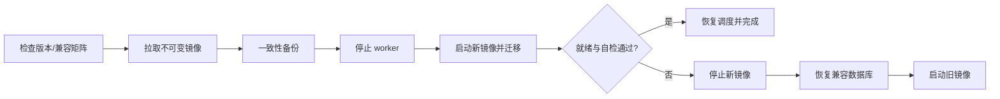

# 部署、运维与安全

## 1. 部署目标

v1.0.0 通过**同一不可变 OCI index digest** 提供 `linux/amd64` 与 `linux/arm64`（aarch64）两种 Linux Docker 平台；单容器内运行 FastAPI、前端静态资源、调度器和单进程 worker。SQLite、日志、密钥与备份保存在 `/config`，媒体和硬链接目标通过 `/data` 暴露。v0.1.9 及更早正式版本仅有 AMD64 镜像，ARM64 没有旧版本可用于跨架构回滚；部署须选择主机对应的平台并记录完整正式 digest。

首版不支持 Kubernetes、多副本或共享数据库。容器必须使用 init/锁机制确保同一 `/config` 只有一个活动 worker。

## 2. 镜像结构

仓库根目录 `Dockerfile` 已采用三阶段构建：

1. Node 22 + pnpm 10.34.5 按冻结锁文件构建 Vue 前端。
2. Python 3.11 + uv 0.12.11 按 `uv.lock` 的 runtime 依赖构建 `/opt/venv`，不安装 dev group。
3. 精简 Python 3.11 runtime 只复制运行 venv、后端/迁移和前端 dist，并由 FastAPI 同源服务 `/` 与 `/assets/*`。

运行镜像要求：

- 镜像默认 `USER packbreaker`（UID/GID 1000）。Compose 为初始化 named `/config` 卷可短暂以 root 运行入口包装器；包装器只递归调整应用专属 `/config` 所有权，再按 `PUID`/`PGID` 永久降权后才导入/启动服务。`/data` 不自动 chown。已发布 v1.0.2 及以前入口会清空全部附加组；v1.0.3 研发候选仅在确有需要且可证实为 Unix socket 时保留挂载的 `docker.sock` 数字组，其余附加组继续清空。
- 只包含运行依赖，不包含测试工具、源码缓存、Node modules 和真实配置。
- 基础 Node/Python 镜像使用精确补丁版本 + sha256 digest 固定；正式发布按最终镜像 digest 生成 SPDX JSON SBOM。可移动 `stable` 只作发现通道，不能作为生产部署身份。
- OCI 标签包含版本、Git revision、构建时间、源码地址和许可证。
- 入口先验证配置和迁移，再启动应用；迁移失败不得启动 worker。
- tag 发布由 `.github/workflows/release.yml` 生成最终 GHCR image digest、SPDX JSON SBOM、release manifest、`SHA256SUMS` 与 GitHub Release notes；生产部署记录必须使用 release manifest 的完整 `<image>@sha256:<digest>`。

## 3. 目录与权限

| 容器路径 | 内容 | 权限 |
| --- | --- | --- |
| `/config` | SQLite、加密密钥文件、日志、备份、运行锁 | 应用用户读写，目录建议 0700 |
| `/data` | 媒体源、硬链接目标、受控 staging | 按路径策略读/写；不能包含应用秘密 |
| `/tmp` | 临时解析和导出 | 容器临时空间，定期清理 |
| `/var/run/docker.sock` | 单容器一键升级或独立 `packbreaker-updater` helper 使用 | 挂载即拥有 Docker 主机级管理权限，只应在受信宿主机启用 |

硬链接要求源与目标在内核允许的同一挂载/文件系统内。部署时应把源目录和目标目录的共同父目录一次性挂载到 `/data`，再通过应用允许根目录限制访问。把两个子目录分别 bind mount 可能产生 `EXDEV`，即使宿主机底层存储相同。

应用启动和保存下载器配置时执行路径诊断：容器可见性、device ID、普通文件、权限、符号链接、创建临时硬链接和清理测试。诊断未通过的映射不能启用自动执行。

### 下载器使用 `/downloads`、`/downloads2` 时的路径映射

下载器的保存路径（远程路径）与 **PackBreaker 容器内**可访问的文件路径不是同一个字段。默认 `PACKBREAKER_DATA_DIR=/data` 时，下载器配置表单应填写：

| 下载器路径（左侧） | PackBreaker 容器路径（右侧） |
| --- | --- |
| `/downloads` | `/data/downloads` |
| `/downloads2` | `/data/downloads2` |

前提是相应文件**已经**在 PackBreaker 容器的 `/data/downloads`、`/data/downloads2` 可见。仓库的 Compose 默认将主机 `${PACKBREAKER_DATA_PATH:-./runtime/data}` 整体挂载到 `/data`；若主机下载目录不在该父目录下，应在部署时调整公共父目录挂载，并确认容器内路径；修改挂载通常需要重建容器。不要为了使保存通过而将数据根目录改为 `/`，也不要简单绕过容器路径边界校验。旧映射变更后，原有执行计划必须重新进行路径诊断与授权。

例如：左侧写 `/downloads`、右侧也写 `/downloads` 会被拒绝，因为后者不在 `/data` 下；这与下载器是否真正连接成功无关。若只挂载 `/downloads` 而未挂载到 `/data/downloads`，请先修正 Docker 挂载。通过保存校验也不代表已通过启用所需的文件、目录、权限和硬链接诊断。

#### Synology Container Manager：保留现有 `/data` 卷的增量挂载方案

在一种已经确认的真实部署中，`/volume2/videos/downloads` → `/downloads`、`/volume3/videos2/downloads` → `/downloads2`；`/data` 是已有独立 Docker 数据卷，`/config` 另有持久挂载。此时不需要更改下载器原有路径，**不能仅凭原有两个挂载就把右侧配置为 `/downloads`**。拟重建后的卷清单应在保留原有所有卷及其身份的前提下追加：

| Synology 主机目录 | 追加的 PackBreaker 容器目录 |
| --- | --- |
| `/volume2/videos/downloads` | `/data/downloads` |
| `/volume3/videos2/downloads` | `/data/downloads2` |

`/config` 原宿主机路径与 `/data` **原 Docker 卷的精确名称/来源**必须保持不变，不应创建一个空白 `/data` 新卷；`/downloads`、`/downloads2` 原挂载可保留供旧配置使用。应用原有 `/data` 文件不会因为增加子目录挂载而自动迁移；如果原卷已有同名目录，新的子挂载会暂时遮挡其内容，必须先只读核对并处理冲突，不能直接覆盖。重建前先按既有备份流程获得一致性配置备份，并记录旧镜像不可变摘要、网络、端口、环境变量名（不要导出秘密值）、卷及权限。Container Manager 不同版本的「编辑/复制设置」行为不同，**不能假定复制设置会自动复用匿名 `/data` 卷**；若不能指定旧卷，先停止操作并改用能准确重挂旧卷的明确方案。生产容器的停止、重建和存储调整必须由管理员另行确认执行；本示例并未对生产容器作任何更改。

仅供核对卷身份的**只读**命令（不会展示容器环境变量与凭据）：

```bash
docker inspect packbreaker --format '{{range .Mounts}}{{if or (eq .Destination "/data") (eq .Destination "/config")}}{{printf "%s type=%s name=%s source=%s\n" .Destination .Type .Name .Source}}{{end}}{{end}}'
```

原宿主目录分别位于 `/volume2`、`/volume3`，不能假定两个目录间允许硬链接。即使在同一个宿主文件系统，Docker 不同 bind mount 之间也可能遇到 `EXDEV`；必须在目标所处的真实路径执行现有受控路径诊断，不可据「目录存在」断言硬链接可用。只读排查阶段不对真实文件执行创建/删除试验。

**不强制 `/data` 是否可选？** 在当前版本中，数据根目录是任务扫描、执行计划、硬链接、清理/回滚和文件系统安全网关共同依赖的单一授权边界，并非下载器表单的孤立输入限制。可以单独设计「管理员明确授权的多个数据根目录」作为未来功能，但必须逐一证明所有任务与写入/回滚链路对跨根路径、挂载点、软链接、device ID 及历史计划的失败关闭；不能通过直接删除 `is_relative_to(root)`、将 `PACKBREAKER_DATA_DIR` 设置为 `/` 或创建指向根目录外的软链接实现。

## 4. 启动配置

仅保留无法安全放入数据库或启动前必须知道的环境变量：

| 变量 | 默认值 | 说明 |
| --- | --- | --- |
| `PACKBREAKER_HOST` | `0.0.0.0` | 监听地址 |
| `PACKBREAKER_PORT` | `8000` | HTTP 端口 |
| `PACKBREAKER_CONFIG_DIR` | `/config` | 配置与状态目录 |
| `PACKBREAKER_DATA_DIR` | `/data` | 数据根目录 |
| `PACKBREAKER_FRONTEND_DIR` | 镜像内 `/app/frontend/dist`；源码运行默认空 | 前端静态构建目录；设置时必须为绝对路径且包含 `index.html`/`assets` |
| `PACKBREAKER_SECRET_KEY_FILE` | `/config/secret.key` | 主密钥文件；首次启动安全生成 |
| `PACKBREAKER_LOG_LEVEL` | `INFO` | 日志级别 |
| `PACKBREAKER_TIMEZONE` | `Asia/Shanghai` | 仅影响调度和展示，数据库仍保存 UTC |
| `PACKBREAKER_TRUSTED_PROXIES` | 空 | 明确列出的反向代理网段 |
| `PACKBREAKER_TASK_DRIVER_INTERVAL_SECONDS` | `15` | 活动任务周期 tick 间隔，范围 1..3600 秒 |
| `PACKBREAKER_TASK_DRIVER_LIMIT` | `100` | 每次 tick 最多扫描的活动任务数，范围 1..1000 |
| `PACKBREAKER_TASK_DRIVER_MAX_STEPS_PER_TASK` | `4` | 单任务每次 tick 最多连续推进的 stage 数，范围 1..16 |

环境变量不得直接承载站点 passkey、下载器密码和通知 Token。首次主密钥使用密码学安全随机源生成 256-bit 随机值，文件权限设为 0600；文件已存在但权限过宽或长度无效时拒绝启动 worker。secret store 使用 AES-256-GCM，认证附加数据绑定 secret ID、类型和密钥版本，数据库只保存认证密文。

## 5. Compose 蓝图

仓库根目录 `compose.yaml` 可直接用于本地构建/启动：

```bash
export PACKBREAKER_DATA_PATH=/path/to/common/storage
export PUID=1000  # 可设为 0，以 root UID 运行服务进程
export PGID=1000  # 可设为 0，以 root GID 运行服务进程
docker compose up --build -d
```

Compose 使用 `packbreaker-config` named volume 保存 SQLite、主密钥和锁，数据根通过 `PACKBREAKER_DATA_PATH` 显式 bind mount 到 `/data`；默认 HTTP 端口为 8000，可用 `PACKBREAKER_HTTP_PORT` 修改宿主机端口。容器设置 `no-new-privileges`，健康检查执行 `python -m backend.app.healthcheck`，只请求本机 `/api/v1/health/ready`。

生产部署建议把实际运行版本记录为正式 Release manifest 中的不可变 digest。Compose 用户可以选择两种升级方式：不挂载 Docker socket 时由宿主机显式更新 digest；显式挂载 `/var/run/docker.sock` 时允许从 Web 发起一键升级。Web updater 会保留 Compose labels、端口、环境变量、挂载、restart policy 和受支持的单网络配置，但不会修改宿主机上的 `compose.yaml`，因此 Web 升级后必须把 YAML 中的 `image:` 同步到新 Release digest，避免后续 `docker compose up` 按旧声明重新创建旧版本。

独立 `docker run` 的推荐易用部署是“单常驻容器”模式：主 PackBreaker 挂载 Docker socket，平时只有一个 `packbreaker` 容器；用户在左上角版本弹窗点击一键升级时，主服务完成正式 Release/digest 复验和一致性备份，然后临时创建一个 `AutoRemove` updater 容器。临时 helper 接管后停止旧主容器、按原部署参数创建新主容器、等待 healthcheck，并在失败时恢复切换瞬间数据库与旧容器。helper 退出后由 Docker 自动删除，因此升级结束后重新回到单常驻容器状态。

```bash
docker run -d \
  --name packbreaker \
  --restart unless-stopped \
  --user 0:0 \
  -e PUID=0 \
  -e PGID=0 \
  -e PACKBREAKER_TIMEZONE="Asia/Shanghai" \
  -p 8000:8000 \
  -v /root/packbreaker/config:/config \
  -v /var/run/docker.sock:/var/run/docker.sock \
  ghcr.io/yyxiaoma/packbreaker:latest
```

需要访问媒体目录时，仍应按实际公共父目录额外挂载 `/data`。`docker.sock` 等价于 Docker 主机级管理权限，因此该易用模式只应部署在受信宿主机；PackBreaker 的升级 API 仍只接受官方 Release 的 `ghcr.io/yyxiaoma/packbreaker@sha256:<digest>`，并只重建名为 `packbreaker` 的受支持单容器拓扑。

若不愿把 Docker socket 授予主容器，仍可采用兼容的最小权限模式：主 PackBreaker 不挂 docker.sock，另外常驻 `packbreaker-updater`，二者共享同一个 `/config`。独立 helper 使用 `/config/updater/updater.sock` + 随机 token 接受受限升级请求。该模式继续受支持，但不再是独立 `docker run` 的默认易用部署。

如果使用自定义 `PUID`/`PGID`，应确保 `/data` 内需要读取的源文件和允许创建目标链接的目录对该数字身份有适当权限；Web 一键升级还要求主进程身份能够访问挂载的 Docker socket。`0` 是有效值；`PUID=0`、`PGID=0` 时服务进程保持 root 身份运行。入口不会为了方便而修改媒体树所有权。默认仓库 `compose.yaml` 不授予 Docker 管理权限；需要 Web 升级时可由用户显式取消 docker.sock 挂载注释。

**v1.0.3 候选的 socket 权限修复与现场排查：** Compose 的 `user: "0:0"` 并不意味着 Web 进程一直是 root：入口可能根据 `PUID`/`PGID` 降权。已发布的 v1.0.1/v1.0.2 即使挂载 `docker.sock`，也可能因该降权清除 socket 数字组导致一键升级失败。可以仅执行以下只读诊断，核对 Docker socket 类型、权限及**实际 Web 进程**的有效身份/附加组（`docker exec` 新建的进程不代表 Web 进程权限）：

```bash
docker exec --user 0:0 packbreaker sh -c 'stat -c "socket: %F %a %u:%g" /var/run/docker.sock; grep -E "^(Uid|Gid|Groups):" /proc/1/status'
```

该命令不包含站点凭据或媒体读取。不要直接 `chmod 666 /var/run/docker.sock`、修改宿主机 Docker daemon 或以 root 常驻 Web 来绕过错误。若 socket 是 `0600` 且运行身份不是 owner、socket GID 不可映射，或 Docker API/目标容器被额外策略阻断，v1.0.3 仍会安全阻断升级并展示区分后的错误；须按现场证据单独处理。

**旧容器不能通过加载新的前端文件自行修复旧入口进程。** 如果在线升级已被当前旧容器阻断，应先核对现有数据库/主密钥备份，在新版正式发布后通过宿主机 `docker compose pull packbreaker`、`docker compose up -d --no-deps packbreaker` 做一次人工升级，再在新版验证 Web 后续升级。仅对已通过正式发布与相邻版本升级验证的版本执行操作；`latest` 是可变通道，升级前确认实际拉取版本及 Compose 文件中的 `image:`。

## 6. 网络与反向代理

- 推荐只监听内网或通过 HTTPS 反向代理访问；公网暴露不属于 v1.0 支持范围。
- 只有 TCP 直连来源命中 `PACKBREAKER_TRUSTED_PROXIES` 中的 IP/CIDR 时才接受 `X-Forwarded-For` 与 `X-Forwarded-Proto`；客户端地址从代理链右侧逐级剥离可信代理，非法链回退到直连地址。
- 会话 Cookie 在直接 HTTPS 或受信代理声明 HTTPS 时使用 Secure；未受信来源不能靠伪造转发头启用代理上下文。反代仍需保留 Host、真实 scheme 和 SSE 长连接。
- 出站访问仅允许已配置站点、下载器、通知和版本检查目标；日志不得记录带查询秘密的 URL。
- 响应统一设置 CSP、`X-Content-Type-Options: nosniff`、`Referrer-Policy: no-referrer`、`X-Frame-Options: DENY` 与 Permissions-Policy；HTTPS 上额外设置 HSTS。Swagger 文档只放行自身、必要 CDN 和 OpenAPI 请求。

## 7. 数据库、备份与恢复

### 7.1 备份

- 使用 SQLite Backup API 生成一致性快照，不能只复制活跃 WAL 下的主 `.db` 文件。
- 当前已提供 `python -m backend.app.maintenance backup`；默认输出到 `/config/backups`（源码运行时为 `<PACKBREAKER_CONFIG_DIR>/backups`）。每个 `.db` 快照同时生成 `.json` manifest，记录 SHA-256、字节数、应用版本和 Alembic revision；可用 `python -m backend.app.maintenance verify-backup <backup.db>` 离线复验。
- 升级前强制备份；另支持手动和计划备份。
- 备份包含数据库、schema/app 版本、校验摘要和必要的非敏感部署元数据。
- 主密钥不默认打包；包含凭证的可迁移导出必须由用户提供独立口令再次加密。
- 备份先写临时文件、fsync 后原子重命名，并按保留策略清理。

当前 M6 已覆盖一致性数据库快照、离线验证、下述离线恢复底座、普通备份保留策略、默认关闭的计划备份调度与管理界面；GitHub Actions container 门禁也已完成停止服务、离线 verify/restore、重启 readiness 的真实 Docker 演练。

普通备份保留默认只预览：

```bash
python -m backend.app.maintenance backup-retention --retention-days 30 --keep-latest 3
python -m backend.app.maintenance backup-retention --retention-days 30 --keep-latest 3 \
  --apply --confirm-delete-expired-backups
```

保留策略只处理 `/config/backups` 根目录中可完整验证的 PackBreaker `.db/.json` 成对备份；不会递归进入 `pre-restore/`，也不会删除外来、孤儿或损坏文件。

### 7.2 恢复

恢复流程必须在 worker 停止时执行：验证摘要和版本兼容，备份当前状态，恢复到临时位置，运行数据库完整性检查和只读迁移预检，再原子切换。失败时恢复原状态。

当前 M6 已提供离线恢复命令：

```bash
python -m backend.app.maintenance restore-backup /config/backups/<backup>.db \
  --confirm-replace-current-database
```

恢复命令与主服务复用同一实例锁；只要活动 PackBreaker 仍持有 `/config/packbreaker.lock` 就会失败关闭。恢复前会自动创建 `backups/pre-restore` 一致性安全快照，待恢复副本在临时文件上执行 Alembic `upgrade head`、完整性检查和 journal 规范化后才原子切换；切换后验证失败会自动从安全快照回滚。GitHub Actions run `34851129257` 已在目标 linux/amd64 Docker 方式完成停止服务、一次性恢复、重启与 readiness 实机演练。

主密钥丢失时，密文凭证不可恢复；任务和非敏感配置仍应可读，但所有依赖凭证的适配器必须禁用并要求重新录入。

### 7.3 发布前 preflight

发布/升级前先运行：

```bash
python -m backend.app.maintenance preflight
```

该命令不访问 PT、下载器、通知渠道，也不遍历媒体树。它检查 `/config` 权限、SQLite `integrity_check` 与 Alembic head、现有 `secret.key` 0600/32-byte 与 AES-GCM 自检、`/data` 根可见性、默认 docker.sock 风险，并实际创建/验证/清理一次 preflight 一致性快照。任一关键项 blocked 时退出码为 2。`--skip-backup-exercise` 只用于明确不允许写入 `/config/backups` 的诊断场景，并会留下 warning。

### 7.4 Docker Compose 备份与恢复 runbook

以下命令假设仓库根目录的 `compose.yaml`，并保持维护命令使用与服务一致的数字 UID/GID，避免在 named volume 内产生 root-owned 状态：

```bash
export PUID=${PUID:-1000}
export PGID=${PGID:-1000}

# 服务运行时先做发布预检和一致性备份
docker compose exec --user "$PUID:$PGID" packbreaker \
  python -m backend.app.maintenance preflight
docker compose exec --user "$PUID:$PGID" packbreaker \
  python -m backend.app.maintenance backup

# 记录上一步 JSON 返回的 database_file，然后停止服务
docker compose stop packbreaker

# 离线复验并恢复指定备份；restore 会再创建 pre-restore 安全快照
docker compose run --rm --no-deps --user "$PUID:$PGID" packbreaker \
  python -m backend.app.maintenance verify-backup /config/backups/<backup>.db
docker compose run --rm --no-deps --user "$PUID:$PGID" packbreaker \
  python -m backend.app.maintenance restore-backup /config/backups/<backup>.db \
  --confirm-replace-current-database

# 重启并检查 readiness
docker compose up -d packbreaker
docker compose exec packbreaker python -m backend.app.healthcheck
```

如果最后一步 readiness 失败，不要删除 `backups/pre-restore`。先停止服务，再使用恢复命令把本次 `pre-restore` 安全快照恢复回去，随后启动原镜像并重新检查 readiness。旧镜像无法读取新迁移数据库时也必须走备份恢复，不能只切镜像标签。

### 7.5 计划备份

计划备份策略持久化在 PackBreaker SQLite 中，默认关闭。启用后 BackupDriver 周期读取策略，只在最近成功备份超过配置周期时创建普通一致性备份；它不连接 PT、下载器、通知渠道或扫描 `/data`。手动“立即备份”与计划任务共用同一锁，避免重复并发快照。管理 API/UI 可配置 1～168 小时间隔、1～3650 天保留期和至少保留 1～100 份；实际清理继续复用标准 pair 校验与 no-follow 安全门。

计划任务仅备份数据库，不复制 `/config/secret.key`。数据库中的凭证仍是密文，但灾难恢复若没有原主密钥将无法解密，因此 `secret.key` 必须用独立受控方式备份。在线 UI 不提供数据库恢复；恢复必须按 7.4 停服务执行。

## 8. 升级与回滚



当前 RuntimeManager 的数据库启动升级已经使用安全切换底座：取得实例锁后，若数据库落后于代码 head，先创建 `/config/backups/pre-upgrade` 一致性安全快照，再把快照复制到同文件系统临时文件执行 Alembic `upgrade head`、journal 规范化、`integrity_check` 与 head 校验；全部通过后才原子替换当前数据库。迁移副本失败时当前数据库不发生切换，切换后校验失败会自动恢复安全快照。空配置首次安装同样先迁移临时数据库，通过后才原子安装，因此迁移异常不会留下半完成目标数据库。

当前自动化兼容矩阵已覆盖仓库全部 22 个历史 revision（`0001`～`0022`）升级到 `0023_backup_policy`。生产回滚不依赖 Alembic 原地 downgrade：若旧镜像不能读取新 schema，必须恢复 `pre-upgrade`/升级前备份后再启动旧镜像。完整矩阵见 `docs/upgrade-compatibility.md`。

仓库固定 `release-baseline.json` 作为上一正式镜像的不可变升级输入；它是下一候选版本兼容门禁的基线，而不等同于“最新 Release”展示通道。普通 CI container gate 与正式 tag release 在发布后续镜像前都会运行 `scripts/check-release-upgrade.sh`，真实验证 baseline → 当前候选 → 恢复 baseline；正式 tag workflow 还会运行 updater helper 的真实 Docker 自动升级/回滚 E2E。

- 版本与目标镜像只信任正式 GitHub Release manifest 中的官方 `ghcr.io/yyxiaoma/packbreaker@sha256:<digest>`；`stable` 和版本 tag 只用于发现/导航。
- `GET /system/upgrade` 会读取当前正式 Release、目标 digest 和当前可用升级执行器状态；`POST /system/upgrade/actions` 要求管理员会话、CSRF 和 `Idempotency-Key`。
- 写入升级请求前，主服务重新读取正式 Release、执行完整本地 preflight 并创建一致性升级前备份；页面上的旧目标 digest 已变化时直接拒绝。
- 单容器模式由主服务通过 Docker API 启动一次性 `AutoRemove` helper；helper 使用当前镜像中的受限升级程序，目标只接受正式 Release 的官方不可变 digest。兼容的独立 updater helper 仍可作为不授予主容器 docker.sock 的替代方案。
- helper inspect 当前 `packbreaker` 容器，只复制允许的端口、环境变量、挂载、restart policy、Compose labels、单网络等配置；一次性模式会继续保留主容器的 docker.sock 挂载，以便未来版本仍可一键升级。`AutoRemove`、`container:<id>` namespace/网络和多网络、显式静态 IP/MAC 等无法安全重建的部署仍失败关闭。
- helper 停止旧容器后再创建一份“切换瞬间”静止数据库备份，重命名旧容器，创建/启动新容器并等待 Docker healthcheck。新容器健康后尝试删除旧容器；若仅旧停止容器清理失败，健康升级保持成功并留下人工清理提示，不会反向回滚健康新版本。
- 新版本启动、迁移或 healthcheck 失败时，helper 会删除失败的新容器；若数据库可能已被新容器修改，则使用旧镜像的维护命令恢复切换瞬间备份，再把旧容器改回原名、启动并验证健康。自动回滚无法收敛时状态转为 `manual_recovery_required` 并禁止继续覆盖现场。
- 新版本健康检查包含迁移版本、数据库/secret 自检和实例/worker 运行条件，不要求所有 PT 站在线。

## 9. 日志、指标与告警

- runtime 同时向 stdout 与 `/config/logs/packbreaker.jsonl` 输出同一格式的单行 JSON。stdout 继续由 Docker/宿主日志驱动负责保留；应用文件采用容量轮转，默认单文件 2 MiB + 4 个备份（近似总容量 10 MiB），分别可由 `PACKBREAKER_LOG_FILE_MAX_BYTES`、`PACKBREAKER_LOG_FILE_BACKUP_COUNT` 调整。日志目录强制 0700、文件 0600，写入/读取均拒绝跟随符号链接。
- 应用 HTTP 日志只记录 trace_id、方法、路径（不含 query）、状态、来源摘要与耗时；异常只记录异常类型。INFO 记录业务阶段与结果，DEBUG 也不得输出秘密、torrent payload 和第三方原始响应。通用脱敏会屏蔽敏感 key/value；URL 只保留 origin，不保留 userinfo、path、query 或 fragment；单条 message/fields 也有大小上限。
- `GET /api/v1/system/health` 要求管理员会话，只汇总已有证据：runtime readiness、配置/数据卷剩余空间、普通备份新鲜度、任务积压、operation 对账风险、站点熔断/最近连接状态、下载器连接/路径诊断、通知与后台 driver。读取该端点不会主动连接 PT、qB/TR、通知服务，也不会遍历 `/data` 媒体树。
- `/health/ready` 与 `/system/health` 语义分离：前者决定实例能否安全承载工作，后者表达运维告警。站点或下载器离线不会把容器 readiness 变成失败。
- `GET /api/v1/system/diagnostics/export` 使用同一 `config:read` 权限，内存生成只包含 `health.json`/`manifest.json` 的 ZIP，响应 `Cache-Control: no-store` 与内容 SHA-256。诊断包仍与日志导出严格分离，不读取运行日志、配置文件、secret 或媒体，也不输出 URL、业务路径、任务 ID、source/torrent hash。
- `GET /api/v1/system/logs` 读取应用自身轮转 JSONL，默认最近 60 分钟/200 条；允许窗口最大 7 天、单次最多 500 条，并支持级别和最长 128 字符安全关键词过滤。`GET /api/v1/system/logs/export` 复用同一筛选规则，导出硬上限 2000 条，返回内容 SHA-256 和 `Cache-Control: no-store`。读取端再次执行脱敏，因此历史格式异常或人为写入的敏感字段不能直接透传到 API。
- 通知对重复错误聚合，避免站点故障造成消息风暴。
- 当前健康告警阈值：普通备份超过 7 天视为 stale；非终态任务超过 24 小时未更新、未收敛 operation 超过 1 小时进入 warning；配置卷或数据卷剩余空间低于 2 GiB 或 10% 进入 warning。这些阈值仅影响运维态势，不绕过业务安全门。

## 10. 安全检查清单

- 管理口令已设置，默认口令不存在。
- `/config` 与 secret.key 权限正确，备份存储位置受控。
- 站点、下载器、通知测试日志和诊断包通过秘密 canary 测试。
- `/data` 只映射必要共同父目录，应用允许根目录配置正确。
- 使用单容器一键升级时，主 PackBreaker 挂载 docker.sock；该权限等价于 Docker 主机管理权限，只应在受信宿主机启用。若采用最小权限兼容模式，则 docker.sock 仅授予独立 updater helper。
- 真实 `.torrent`、数据库和日志未进入镜像或源码仓库。
- 恢复、升级失败回滚和主密钥丢失场景已经演练。
