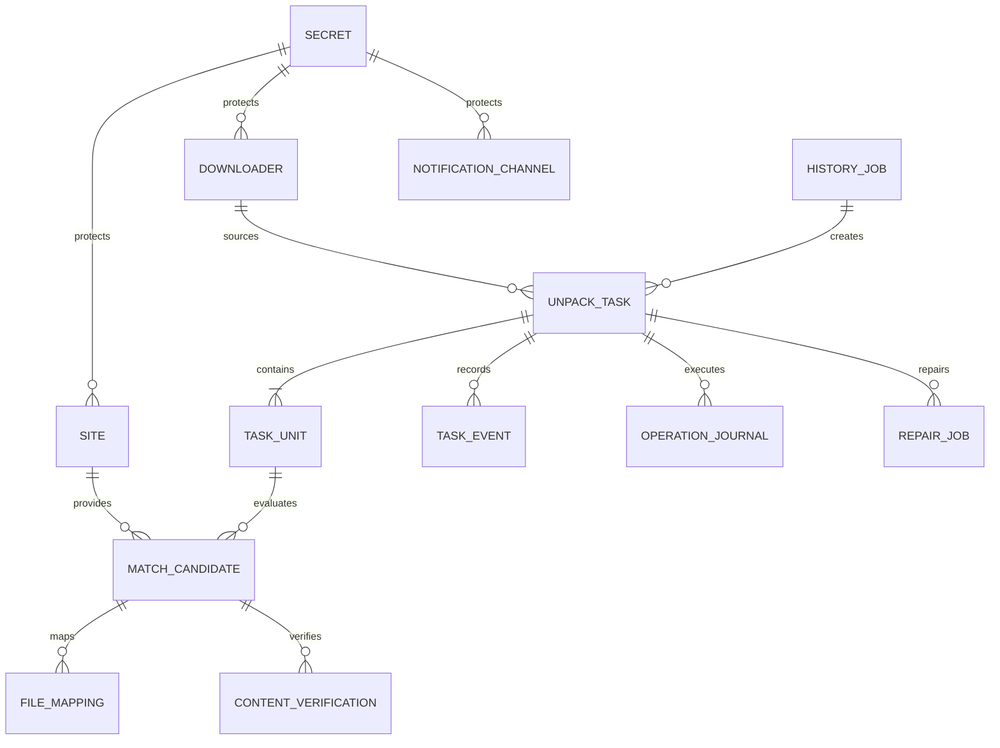
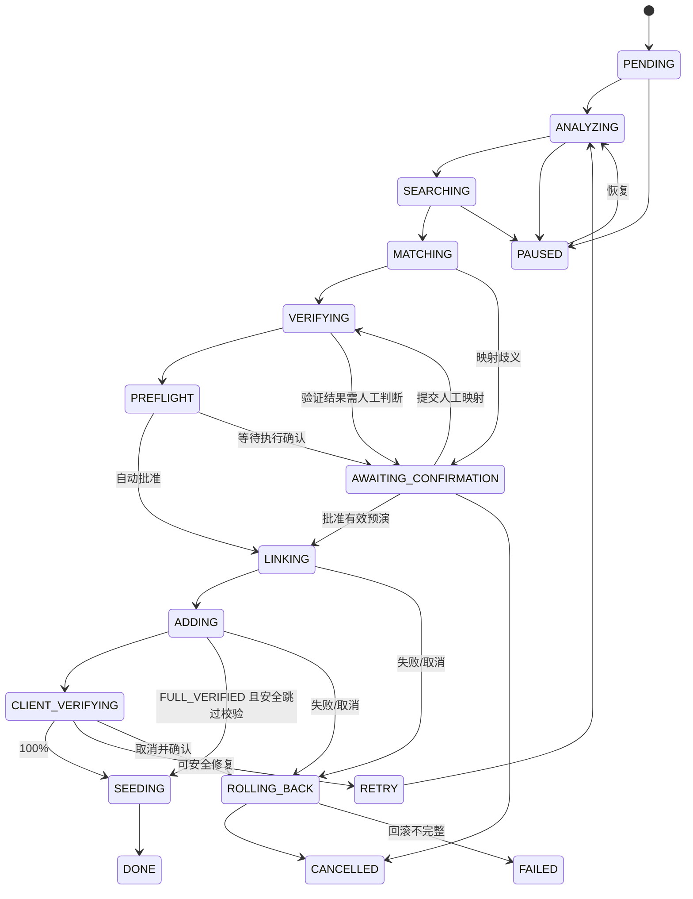

# 领域模型与数据设计

## 1. 设计原则

- 数据库保存业务事实、状态检查点和外部副作用证据，不保存可从 torrent 重建的大块二进制数据。
- 所有主键使用 UUID；所有时间以 UTC 保存并通过 RFC 3339 输出。
- 枚举值写入数据库后视为持久化协议，修改时必须提供迁移与兼容读取。
- 敏感字段只保存密文或不可逆哈希；搜索缓存与错误详情入库前先脱敏。
- JSON 只用于证据快照、能力集和少量站点扩展字段；需要查询、约束或关联的数据使用正式列/表。

## 2. 聚合与关系

## 3. 核心实体

### 3.1 配置实体

| 实体 | 必要字段 | 约束 |
| --- | --- | --- |
| `administrator` | id、password_hash、created_at、updated_at | 首版固定单管理员；只保存 Argon2id 哈希，不保存口令明文 |
| `admin_session` | administrator_id、token_digest、csrf_digest、expires_at、revoked_at、created_at | session/CSRF 明文 token 不入库；撤销和过期状态持久化 |
| `api_token` | name、token_digest、scopes、expires_at、revoked_at、created_at | 明文只在创建响应出现一次；摘要唯一；scope 使用稳定枚举；过期/撤销状态持久化 |
| `site` | name、adapter_type、base_url、secret_id、timeout、retry、rate_limit、enabled、automation_enabled | name 唯一；未绑定凭证不得启用自动化 |
| `downloader` | name、type、base_url、secret_id、monitor_rules、path_mappings、capabilities、connection_status、path_mapping_status、enabled、version | name 唯一；凭证只通过 secret_id 关联；配置修改用 version 乐观并发；连接与路径映射均通过后才可启用自动化 |
| `notification_channel` | type、name、secret_id、config、enabled | 测试成功与启用状态分别保存 |
| `setting` | namespace、key、value、updated_at | `(namespace,key)` 唯一；不得存储明文秘密 |
| `secret` | kind、ciphertext、key_version、updated_at | AES-256-GCM 认证密文；AAD 绑定 ID/类型/密钥版本；只通过加密服务访问，API 永不返回 ciphertext |

### 3.2 任务实体

| 实体 | 必要字段 | 约束 |
| --- | --- | --- |
| `unpack_task` | type、source_downloader_id、source_hash、normalized_unit_key、idempotency_key、status、trace_id、checkpoint、error_code、version | idempotency_key 唯一；状态只能通过领域服务转换；version 用于乐观并发控制 |
| `task_unit` | task_id、kind、display_name、parsed_tokens、source_files、status | 同一任务内稳定排序；解析结果保留算法版本 |
| `match_candidate` | unit_id、site_id、remote_id、torrent_fingerprint、metadata、score、hard_gate_status、decision | `(unit_id,site_id,remote_id)` 唯一 |
| `file_mapping` | candidate_id、candidate_path、source_path、length、mapping_type、status、device、inode | 候选路径唯一；保存执行前快照 |
| `content_verification` | candidate_id、torrent_kind、algorithm_version、total_pieces、verified_pieces、failed_pieces、level、evidence | 每次验证不可覆盖，最新记录单独标识 |

### 3.3 可靠性实体

| 实体 | 必要字段 | 约束 |
| --- | --- | --- |
| `task_event` | task_id、from_status、to_status、event_type、reason、created_at | 追加写，不更新历史事件 |
| `operation_journal` | task_id、idempotency_key、operation_type、target、intent、status、before_snapshot、after_snapshot | idempotency_key 唯一；成功动作必须可对账 |
| `task_action_receipt` | task_id、actor_kind/id、idempotency_key_digest、action、request_digest、state、response/error payload | 同一 actor + 幂等键唯一；只保存键摘要；PENDING 可在未知结果后安全重放既有 coordinator |
| `repair_job` | task_id、mode、affected_files、affected_pieces、status、result | 写入修复前必须保存硬链接隔离证据 |
| `history_job` | roots、include_types、excludes、cursor、status、statistics | 游标持久化，支持暂停和断点恢复 |
| `webhook_receipt` | key_id、nonce、timestamp、idempotency_key、body_digest、status | nonce 与幂等键在有效窗口内唯一 |
| `notification_delivery` | channel_id、event_key、payload_digest、status、attempts、next_retry_at | event_key 防止重复通知 |

## 4. 任务状态机

所有活动状态都可因可重试错误进入 `RETRY`，因不可重试错误进入 `FAILED`。已经创建外部资源的活动状态，失败前必须先判断是否需要 `ROLLING_BACK`。

### 状态转换规则

- 只有状态机服务可以更新 `unpack_task.status`，同时追加 `task_event`。
- 状态转换使用乐观版本号；版本不一致时重新加载，不覆盖其他执行器结果。
- `RETRY` 保存 next_retry_at、attempt、错误类别；达到上限后进入 `FAILED` 或人工队列。
- `PAUSED` 不取消正在进行的单个原子文件操作，但完成后不得启动下一步。
- `SEEDING` 表示 torrent 已满足启动做种的全部安全前置条件或正在确认 start 结果；只有下载器实际返回完整上行状态后才进入 `DONE`。`DONE` 表示 PackBreaker 本次辅种建立流程完成，不表示下载器停止做种。
- `ROLLING_BACK` 使用冻结取消选项与 journal ID 恢复；qB 任务若存在且请求回滚文件，必须先以“只移除任务、不删除数据”的操作确认客户端下载器引用消失，再按 hardlink → directory 的逆序撤销 journal-owned 资源。未决或所有权不明的 journal 不得为了完成取消而强制清理。
- `DONE`、`FAILED`、`CANCELLED` 为终态；重新处理必须创建新 attempt 并关联原任务。

## 5. 操作日志状态

`operation_journal.status` 使用：

- `INTENT_RECORDED`：已记录目标和执行前快照，尚未调用外部系统。
- `APPLIED`：动作成功，已保存外部资源身份和执行后快照。
- `NOOP`：真实状态已满足目标，无需重复执行。
- `ROLLBACK_PENDING`：任务要求撤销此动作。
- `ROLLED_BACK`：已安全撤销。
- `RECONCILE_REQUIRED`：结果未知，必须查询真实状态。
- `ROLLBACK_BLOCKED`：资源已变化或所有权不明确，禁止自动删除。

## 6. 幂等键

- 任务：`sha256(task_type | source_downloader_id | source_hash | normalized_unit_key)`。
- 候选执行：在任务键后加入 `site_id | remote_torrent_id | target_downloader_id`。
- 文件动作：在候选执行键后加入 `operation_type | normalized_target_path`。
- Webhook：调用方提供 `Idempotency-Key`，服务端同时校验 body digest；同键不同 body 返回冲突。

幂等键只用于唯一性和查找，不应包含可逆凭证或完整本地路径。

## 7. 数据保留与清理

- 任务、事件和匹配证据默认保留，具体保留期在 M6 根据实际规模设置。
- 搜索缓存、健康记录和成功通知可按 TTL 清理。
- 操作日志在其创建资源仍存在时不得删除。
- 清理数据库前先确认不存在关联的活动任务、回滚任务或外部资源。
- 数据库备份使用 SQLite Backup API 或等价的一致性快照，不能在 WAL 活跃时只复制主数据库文件。

## 8. 迁移规则

- Alembic revision 与应用版本一同提交；迁移必须可在上一正式版本数据副本上验证。
- 破坏性迁移拆为“新增兼容字段 → 双读/回填 → 后续版本移除”多个版本。
- 启动迁移前生成一致性备份并验证可读；迁移失败时应用不得启动 worker。
- downgrade 不是唯一回滚手段；镜像回滚必须与兼容的数据版本矩阵一起定义。
