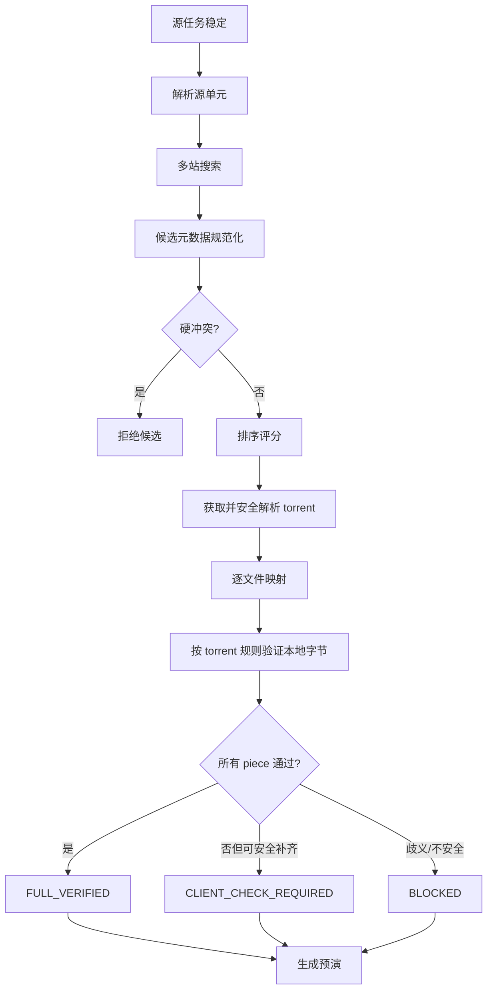

# 匹配验证与文件系统安全

## 1. 安全目标

匹配引擎需要回答两个不同问题：

1. 哪些站点种子可能与本地媒体相同。
2. 本地字节是否足以安全满足候选 torrent。

第一个问题用于减少搜索范围，第二个问题才决定能否跳过下载器校验。任何评分、名称或媒体 ID 都不能替代 piece 验证。

输出不是简单的“匹配/不匹配”，而是不可变的 `PreflightPlan`：候选证据、逐文件映射、验证等级、目标结构、计划动作、预计补齐量、冲突、风险和输入快照。

当前 M2 的第一版持久化证据使用 `PreflightSnapshot`：digest 绑定 task/version、处理单元、完整源 inventory 快照、启用站点 config/version、实际搜索查询、候选评分算法/配置版本、metainfo digest、逐文件映射与验证等级。`created_at` 作为历史元数据保存但不参与 digest，因此相同输入和证据可稳定复现同一 digest。持久层只追加 snapshot，不提供原位 update；写入前再次复核 task、站点和源 inventory，任何变化都要求重新分析。

## 2. 处理流水线

候选在任何阶段失败只影响该候选；解析器崩溃、磁盘错误和安全违规必须以明确错误结束当前任务阶段，不能静默跳过证据。

多站搜索先合并 `(site_id, torrent_id)` 唯一候选并评分，只有前 N 个非硬冲突候选进入详情/取种/字节验证；未入选候选仍保留排序证据，但没有验证等级。站点声明最小请求间隔时，同一分析调用只执行第一条最具体查询，后续放宽查询交给后续调度轮次，禁止为了凑满 1~3 条搜索在一个同步调用里违反站点速率提示。

## 3. Torrent 元数据解析

### 3.1 输入限制

- torrent payload 默认最大 20 MiB，可配置但必须有上限。
- bencode 解析设置嵌套深度、字符串长度、文件数和总声明大小限制。
- 保留计算 Info-hash 所需的原始 `info` 字节区间，不能重新编码后计算 v1 hash。
- 拒绝重复关键字段、负长度、整数溢出、无效 UTF-8 且无法安全展示的路径和不一致的 v1/v2 hybrid 元数据。
- 解析不得创建文件或访问 torrent 声明路径。

### 3.2 统一模型

`TorrentMeta` 至少包含：torrent_kind、v1_info_hash、v2_info_hash、piece_length、文件树、v1 piece hashes、v2 pieces root/piece layers、private、source、display_name 和 metainfo digest。

每个 `TorrentFile` 包含规范化相对路径、原始路径字节的安全表示、长度、padding 标志、零长度标志、文件树顺序和 v2 pieces root。

### 3.3 协议要求

- v1 多文件 torrent 按 `info.files` 顺序拼接为一个字节流，piece 可以跨越文件边界。
- v2 按文件 Merkle tree 验证，正确读取 piece layers；小于 piece length 的文件仍验证文件 root。
- hybrid torrent 必须同时满足其声明的一致性关系；元数据自相矛盾时阻断。
- padding 文件按协议视为零字节范围，不映射到源媒体；需要落盘时创建受控的稀疏/零内容文件并登记所有权。

## 4. 媒体识别与候选排序

### 4.1 规范化 token

保留原始值，并生成用于检索的规范化 token：标题、别名、年份、季/集、分辨率、片源、编码、HDR、音轨、语言、制作组、版本和 IMDb/豆瓣 ID。

- Unicode 进行 NFC 规范化；比较时可进行大小写折叠，但目标路径保留 torrent 原始安全名称。
- 只移除已知发布 token，不以简单分隔符截断片名。
- `S01E02`、`S01E01-E03`、`EP02`、绝对集数和 Specials 分别建模，不互相猜测。
- 年份、季集或外部 ID 明确冲突时作为硬冲突，而不是低分继续自动匹配。

### 4.2 初始排序分数

在真实语料标定前，分数只用于候选排序，不触发自动执行。初始 100 分构成：

| 维度 | 分值 | 说明 |
| --- | ---: | --- |
| 外部媒体 ID | 25 | 相同加分，明确冲突直接拒绝 |
| 标题与别名 | 20 | 规范化 token 相似度 |
| 年份/季集 | 15 | 剧集季集优先作为硬约束 |
| 版本属性 | 15 | 分辨率、片源、编码、HDR、音轨 |
| 总大小 | 10 | 仅排序；不能证明文件一致 |
| 文件列表 | 10 | 文件数、basename、扩展名和长度摘要 |
| 制作组 | 5 | 缺失不扣分，冲突不直接否决 |

使用真实语料评估误报/召回后，权重与自动确认阈值以带版本配置保存。算法版本和配置版本必须写入候选证据，保证历史结果可解释。

## 5. 文件映射

### 5.1 自动映射顺序

每个候选文件按以下顺序寻找唯一源文件：

1. 安全规范化后的完整相对路径与长度完全相同。
2. basename 与长度完全相同，且在当前单元中唯一。
3. 媒体 token、扩展名与长度完全相同，且最优结果不存在并列。
4. 用户在人工确认界面指定映射。

映射一旦出现多个同等候选即标记 `AMBIGUOUS`，不得按遍历顺序选择。媒体文件长度不同不能映射；图片、NFO、字幕等缺失文件标记 `MISSING`，等待后续安全补齐。

### 5.2 映射快照

映射时记录源路径的 device、inode、size、mtime_ns、file type 和可选快速指纹。执行预演批准后、创建链接前再次读取快照；任一字段变化即使预演失效并重新验证。

源符号链接默认拒绝。后续若支持，必须解析真实路径并证明其位于允许根目录，且快照与所有操作均针对真实文件。

## 6. Piece 验证

### 6.1 v1 验证算法

1. 按候选文件顺序构建逻辑字节范围。
2. 将映射源文件、缺失范围和虚拟 padding 组合成只读 range reader。
3. 以 piece length 流式读取，不把完整媒体载入内存。
4. 使用 SHA-1 计算每个 piece 并与 torrent 中对应 hash 常量时间比较。
5. 保存 piece index、结果、覆盖文件和读取错误；不保存媒体字节。

任一 piece 包含 MISSING 或 AMBIGUOUS 范围时不能验证通过。读取期间源快照变化则整次验证作废。

### 6.2 v2/hybrid 验证算法

- 对每个文件按 BEP 52 计算 leaf hash 和 Merkle root，与文件 tree root/piece layer 对比。
- 正确处理最后一个不足 piece length 的块和 Merkle padding。
- hybrid 同时核对 v1 逻辑流与 v2 文件树；任一声明不满足则不能标记 FULL_VERIFIED。

### 6.3 验证缓存

缓存键包含 metainfo digest、所有映射源的 device/inode/size/mtime_ns、算法版本和文件系统读取策略。任一输入变化即失效。缓存只复用验证结果，不绕过执行前快照复查。

## 7. 验证等级判定

- `FULL_VERIFIED`：候选所有非零数据范围均可从稳定本地源或协议 padding 提供，且所有要求的 hash 通过。
- `CLIENT_CHECK_REQUIRED`：映射无安全歧义，但存在未验证、缺失或不匹配范围；可安全准备后由客户端下载/校验。
- `BLOCKED`：路径不安全、主媒体无法映射、映射歧义、目标冲突、跨文件系统、源变化或格式不支持。

抽样 hash、MediaInfo、相同总大小或相同 Info-hash 不能单独提升到 FULL_VERIFIED。相同 Info-hash 可复用已有的完整验证证据，但仍需核对源快照。

## 8. 预演计划

`PreflightPlan` 是批准和执行之间的边界，至少包含：

- 输入：源任务版本、候选 metainfo digest、算法/规则版本、生成时间和失效时间。
- 证据：排序分数、硬约束、文件映射、验证结果和人工修改。
- 动作：创建目录、硬链接、padding/小文件、添加下载器、是否跳过校验。
- 资源：目标根、设备 ID、预计新增目录/链接/复制字节/下载字节和临时空间。
- 风险：源变化、跨文件 piece、缺失文件、目标冲突、权限和下载器能力。

执行必须引用 plan ID，并重新验证所有快照和能力。自动批准仅对规则允许且无警告的计划生效；真实语料阈值未标定前默认人工批准。

## 9. 安全创建目录与硬链接

### 9.1 目标路径

- 将 torrent 相对路径逐段验证后连接到配置的 target root。
- 拒绝空路径段、`.`、`..`、绝对路径、Windows drive/UNC 前缀、NUL 和平台不允许名称。
- 使用 resolve 后的父目录再次验证 `is_relative_to(target_root)`；检查过程中不跟随新出现的符号链接。
- 目标已存在时：若与已登记资源的 device/inode/size 一致则视为 NOOP；其他情况一律阻断，绝不覆盖。

### 9.2 创建过程

1. operation journal 写入 intent 与源/目标快照。
2. 验证源为普通文件且仍匹配映射快照。
3. 确认源和目标父目录 device 相同。
4. 在目标父目录创建唯一临时硬链接。
5. 再次检查目标不存在后原子重命名到最终路径。
6. 保存最终 device、inode、size、link count 和创建时间，标记 APPLIED。

目录也逐级登记。并发创建遇到 EEXIST 时查询真实状态，不能直接当作成功。

## 10. 下载器添加与修复

### 10.1 添加

- `FULL_VERIFIED`：qB 可按用户配置跳过客户端校验；Transmission 仍完整校验。
- `CLIENT_CHECK_REQUIRED`：以暂停状态添加，启动完整校验；校验结果明确后再决定下载补齐。
- `BLOCKED`：禁止调用下载器写接口。

添加后核对客户端返回 hash、保存路径、状态和文件列表。任何差异触发暂停与对账。

### 10.2 写入隔离

下载器可能写入的每个目标媒体文件必须是独立 inode：

1. 暂停目标下载器任务并确认停止写入。
2. 识别失败 piece 覆盖的全部文件。
3. 对其中 link count 大于 1 或与源 inode 相同的文件，在同目录创建完整副本。
4. fsync 副本，原子替换目标路径，再确认源 inode/hash 未变。
5. 更新 operation journal 后才允许下载器校验或补齐。

空间不足、源变化、无法暂停或无法隔离时进入人工处理。禁止直接打开硬链接目标写入，也禁止在源文件上做原地 patch。

### 10.3 缺失小文件

- 存在字节完全一致的本地文件时可复制或硬链接，并纳入验证。
- 不存在时保持缺失，让下载器获取对应 piece。
- 如果该 piece 同时覆盖硬链接媒体，先执行写入隔离。
- 任意生成的 NFO、图片、字幕或空文件都不能冒充候选内容。

## 11. 回滚与清理

- 逆序处理 APPLIED 操作；每一步先核对 after snapshot 和当前任务引用。
- 只删除本系统创建且未被其他活动/完成任务引用的目标链接或空目录。
- 资源内容、inode 或所有权不一致时标记 `ROLLBACK_BLOCKED`，保留现场并通知人工处理。
- 从下载器移除任务时始终使用 `delete_data=False`；首版 API 不提供删除数据能力。
- 已完成做种任务默认不自动回滚，除非用户基于最新预演明确确认。
- 定期清理先生成报告，再执行被确认的安全动作；报告包含无法自动清理的原因。

## 12. 错误码与验收

关键错误码包括：`SOURCE_NOT_STABLE`、`PATH_MAPPING_INVALID`、`UNSAFE_TORRENT_PATH`、`MAPPING_AMBIGUOUS`、`SOURCE_CHANGED`、`PIECE_MISMATCH`、`CROSS_DEVICE_LINK`、`TARGET_CONFLICT`、`SOURCE_WRITE_RISK`、`INSUFFICIENT_SPACE`、`DOWNLOADER_STATE_MISMATCH` 和 `ROLLBACK_BLOCKED`。

每个错误必须在测试中证明：发生错误前没有越过对应安全门；发生错误后源内容不变；重复重试不会增加副作用。
